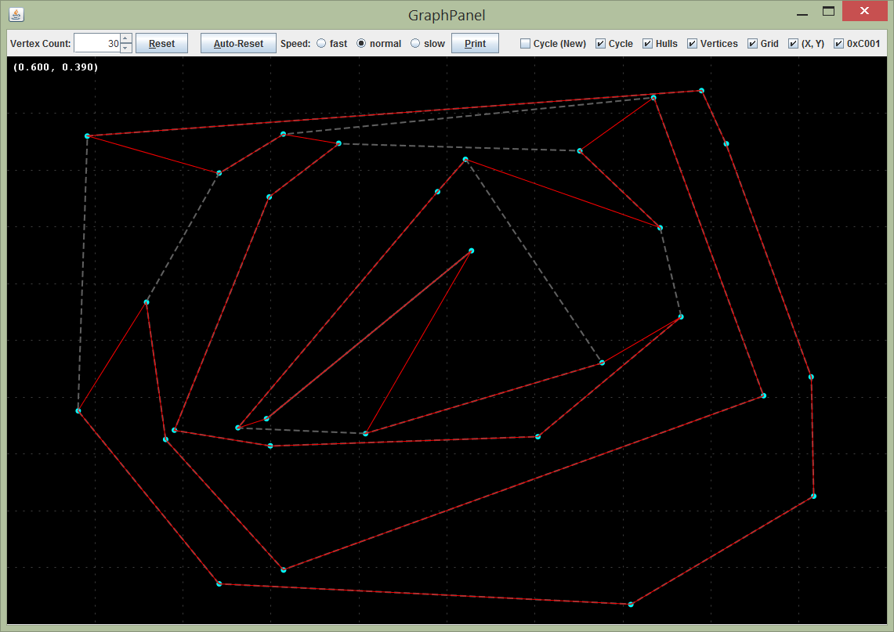
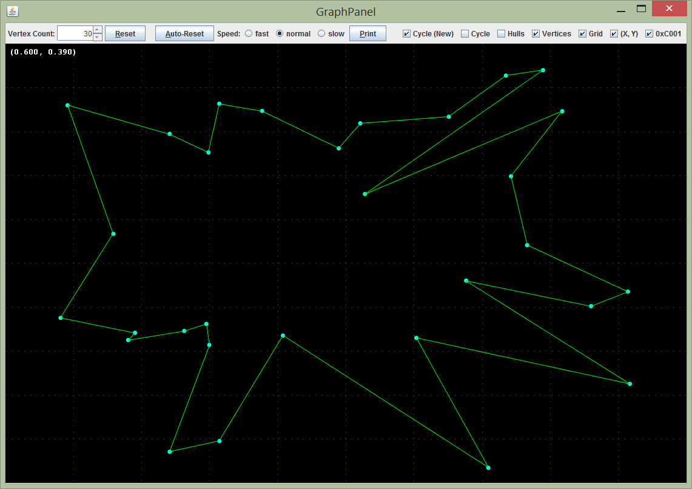
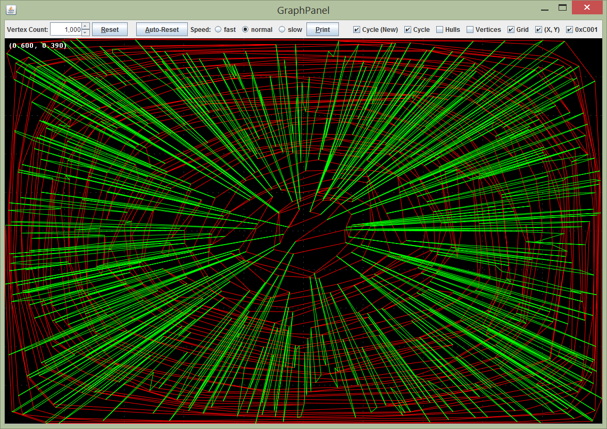

hamiltonian-cycle
=================

Visualization of an algorithm to find a Hamiltonian Cycle of a completely connected graph on the Cartesian plane consisting of no edge/line-segment intersections.

Run:  com.bryanww.cycle.Main

Screenshot - Old Implementation with Convex Hulls

The original problem statement:
"You are given a point set embedding. Obviously, any path is planar in the sense that such an embedding exists. You have to find a path in the given embedding. But actually, you should find a hamiltonian cycle. A path is a good start though.
And a tip: think about recursive convex hulls"

The general solution for finding Hamiltonian Cycles is NP-complete.  In the worst case, this solution still runs in nondeterministic polynomial time since the distance between vertices can be interpreted as a weighted graph.  However, this solution uses a distance heuristic to dramatically reduce the average run time.  The insight into the heuristic is that Hamiltonian cycles appear to form by creating "bridges" between layers of Convex Hulls.  Each "bridge" consists of two pairs of adjacent Convex Hull vertices, one on the "parent" hull and one on the "child" hull.  Each bridge is searched for recursively, and intersections are tested by using line equations to find intersection points.  The boundary conditions for hulls of three vertices or less is specifically handled.

The naive implementation of the algorithm would perform a brute-force search to find the bridges.  However, to improve on the runtime performance, a distance heuristic is first performed which sorts candidate bridge vertices by distance from the parent hull vertices.  This heuristic takes advantage of the observation that the best bridges tend to be the shortest and that hull vertices on the opposing side of the hull are likely to intersect with the hull vertices closer to the parent bridge vertices.

If the bridge heuristic fails the algorithm might fail since it does not fall back to an exhaustive search.  However, the algorithm might be still be mathematically correct; a proof would need to take advantage of Graph Theory and likely the Triangle Inequality.  The algorithm so far has been tested using the GraphPanel over a few thousand iterations (see the auto-reset function).

Update
======

Screenshot - New Implementation with Star Algorithm

Although the existing solution does take advantage of the fact that the graph is completely connected, a new solution was brought to my attention that ignores the idea of Convex Hulls.  This idea is much more simple; shift the vertices so they're centered around the origin, then sort them in order of angles from the origin.  The angle is defined by the vector from the origin to the vertex and an arbitrary vector, in this case at (1, 0).  This algorithm is much simpler and runs in O(nlgn) time.

Here's a comparison of the two approaches:

